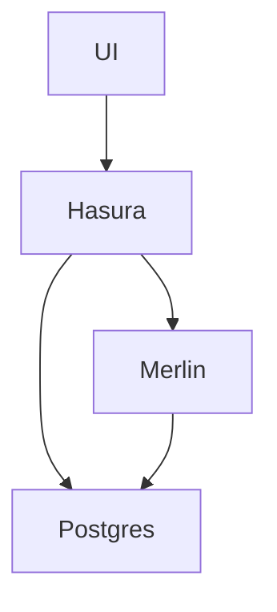
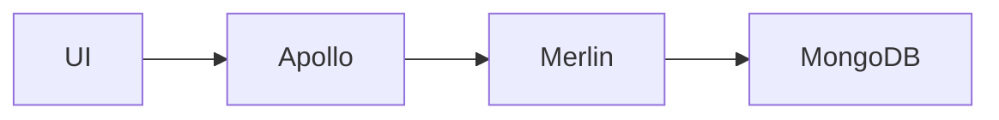

# ADR-0003 - Use Hasura and Postgres

## Status

Retroactive

## Context

At the time, the Aerie team was developing and maintaining an API server, using [Apollo](https://www.apollographql.com/). The team found themselves spending a lot of their time on repetitive tasks involving adding endpoints to create, read, update, or delete some domain object.

## Decision

Implementing an API requires developers to write a lot of repetitive code. Many API calls are simply Create, Read, Update, or Delete (CRUD) operations to the database. The translation of GraphQL queries to SQL can be automated to save developers a lot of toil. This is what [Hasura](https://hasura.io/) does.

To add a new node to the GraphQL API graph, a developer needs to create the corresponding table in the database, and update the Hasura metadata, stored in yaml files, to communicate to Hasura that that table should be exposed via the API.

Hasura produces rich APIs that allow sorting and filtering data out of the box. This saves developers the work of adding sorting and filtering to each node individually.

As a result, Hasura boosts the productivity of the development team, and provides a higher quality API to users.

## Alternatives considered

The status quo before this decision was made was Apollo GraphQL with a MongoDB backend. The architecture looked more like this:

Every new domain object would need to be added first to MongoDB, then to Merlin and exposed as an HTTP endpoint, and lastly to Apollo and exposed as a GraphQL endpoint.

Hasura came with postgres support out of the box, and this to some extent drove the decision to switch to postgres. Additional justification came in the form that most Aerie data is well structured, and fits well into a relational schema. The need for open-ended user-defined data will be implemented using `jsonb` , which we expect to be sufficient for our purposes.

MongoDB was originally selected because it's the backend for RAVEN, which some of the developers had worked on before.

## Consequences

Using Hasura allowed the Aerie team to deliver features like filtering and sorting for every query without additional development effort.

## References

- https://hasura.io/docs/2.0/index/
- https://www.postgresql.org/docs/
